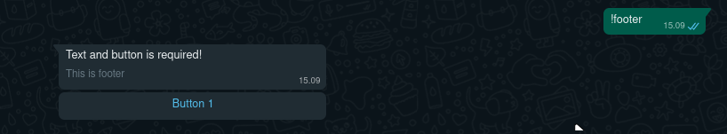

# $footer

Add a footer in the message.


Footer will only appear if there is a `$button`!


### Usage:

```
$footer[text]
```

### Example:

```javascript
bot.command({
    name: "footer",
    code: `Text and button is required!
    $button[id1:Button 1]
    $footer[This is footer]`
});
```


