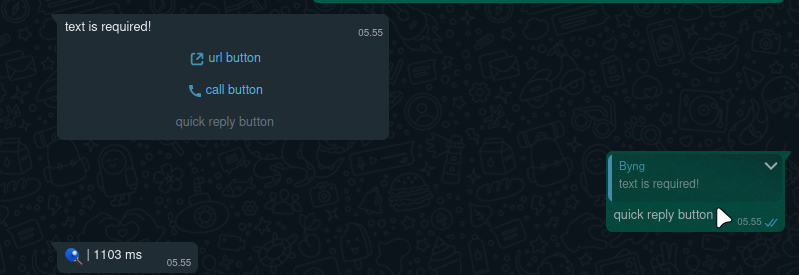

# $templateButtons

This function is useful for buttons that have an action such as going to a regular url, call, or quick reply.

### Usage:

```
$templateButtons[(url/call/quickReply):display Text:value;...]
```

### Example:

```javascript
bot.command({
    name: "templatebuttons",
    code: `text is required!
$templateButtons[url:url button:https://whatscode.jstnlt.my.id;call:call button:123;quickReply:quick reply button:!ping]`
})
```




You can use the value of the `quickReply` button with one of your bot's commands, if it is clicked it will run the command. Same as in the regular `$button` function.

